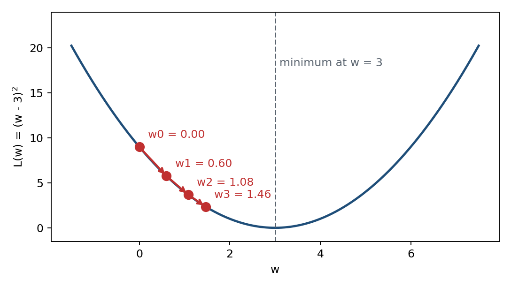
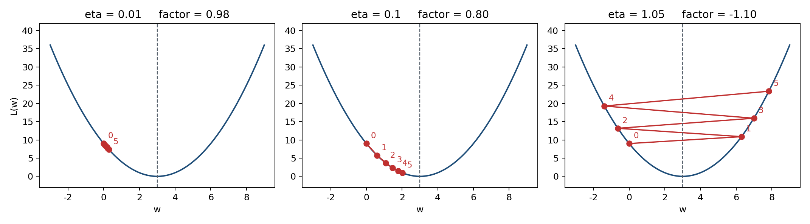
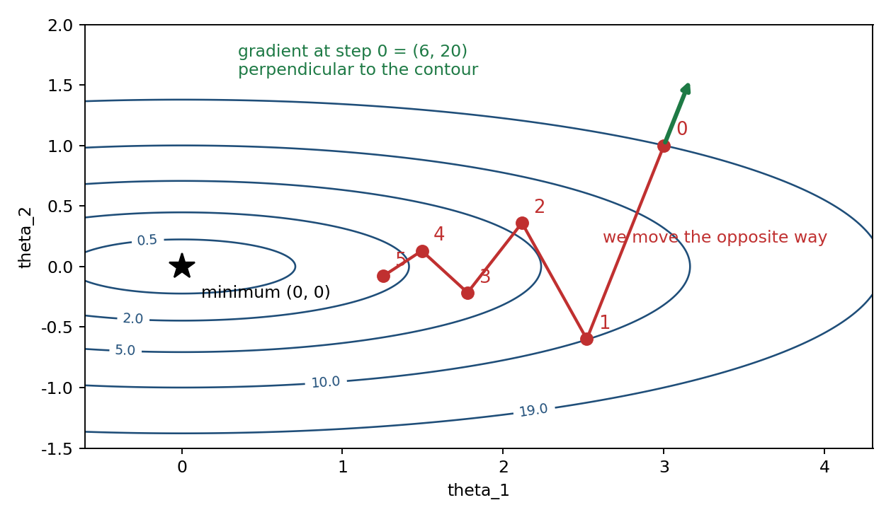

# 這份教材補的是什麼

補充教材第 30 至 39 頁講梯度下降，十頁裡有更新式、有等高線圖、有損失地形，
最後一頁寫「This is the "learning" of machines in deep learning」。

但是整段看完，沒有一個數字是算得出來的，也沒有一行程式可以跑。

這份補的就是那一段：**同一個例子，從手算走到手寫程式，再走到 TensorFlow 2 框架版，
三邊的數字必須一樣**。

全份只用一個示範函數：

$$L(w) = (w-3)^2 \qquad \frac{dL}{dw} = 2(w-3)$$

起點 $w^{(0)} = 0$，學習率 $\eta = 0.1$。最小值在 $w = 3$，一眼就看得出來——
**示範題一定要選手算得出答案的，否則程式算錯你不會知道**。

**怎麼用這份教材**：先做第二節的手算練習，自己填完那張表；再把程式貼到 Colab 跑，
確認跑出來的數字和你填的一樣；最後看第五節。全部做完大約 90 分鐘。

---

# 一、更新式

$$\theta^{(k+1)} = \theta^{(k)} - \eta\,\nabla L(\theta^{(k)})$$

| 符號 | 意思 |
|---|---|
| $\theta$ | 參數 parameters，就是模型要學的那些數字 |
| $L$ | 損失函數 loss function，越小代表模型越準 |
| $\eta$ | 學習率 learning rate，一步要走多遠 |
| $\nabla L$ | 梯度，$L$ 對各個參數的偏微分組成的向量 |

那個**減號**是重點。梯度指的是上坡方向，我們要往下坡走，所以減掉。

以起點 $w^{(0)} = 0$ 為例：

$$\frac{dL}{dw}\bigg|_{w=0} = 2(0-3) = -6$$

梯度是負的，所以 $w$ 往**正**的方向移動：

$$w^{(1)} = 0 - 0.1 \times (-6) = 0.6$$



---

# 二、手算練習

把下表填完。每一列都是同三個動作：算梯度、乘學習率、減掉。

| $k$ | $w^{(k)}$ | $dL/dw = 2(w-3)$ | $\eta \times$ 梯度 | $w^{(k+1)}$ | $L(w^{(k)})$ |
|---|---|---|---|---|---|
| 0 | 0.000000 | −6.000000 | −0.600000 | 0.600000 | 9.000000 |
| 1 | 0.600000 | | | | |
| 2 | | | | | |
| 3 | | | | | |
| 4 | | | | | |
| 5 | | | | | |
| 6 | | — | — | — | |

填完之後對答案：

| $k$ | $w^{(k)}$ | $dL/dw$ | $L(w^{(k)})$ |
|---|---|---|---|
| 0 | 0.000000 | −6.000000 | 9.000000 |
| 1 | 0.600000 | −4.800000 | 5.760000 |
| 2 | 1.080000 | −3.840000 | 3.686400 |
| 3 | 1.464000 | −3.072000 | 2.359296 |
| 4 | 1.771200 | −2.457600 | 1.509949 |
| 5 | 2.016960 | −1.966080 | 0.966368 |
| 6 | 2.213568 | −1.572864 | 0.618475 |

## 為什麼六步還沒走到 3

因為梯度下降是逐步逼近，不是一步到位。這個例子有閉式解可以反查：

$$w^{(k)} = 3 - 3\,(1-2\eta)^{k}$$

$\eta = 0.1$ 時 $(1-2\eta) = 0.80$，也就是每一步距離終點都只剩上一步的八成。
損失從 9.000000 降到 0.618475，降幅越來越小——因為越靠近最小值，梯度越小，步伐自然就變短。

**自己驗一次**：把 $k=3$ 代進閉式解，$3 - 3 \times 0.8^3 = 3 - 1.536 = 1.464$，和表上一樣。

---

# 三、學習率

補充教材第 37 頁說學習率會影響結果，但沒給數字。三種各跑五步：



| $k$ | $\eta = 0.01$ | $\eta = 0.1$ | $\eta = 1.05$ |
|---|---|---|---|
| 0 | 0.0000 | 0.0000 | 0.0000 |
| 1 | 0.0600 | 0.6000 | 6.3000 |
| 2 | 0.1188 | 1.0800 | −0.6300 |
| 3 | 0.1764 | 1.4640 | 6.9930 |
| 4 | 0.2329 | 1.7712 | −1.3923 |
| 5 | 0.2882 | 2.0170 | 7.8315 |

收斂係數是 $(1-2\eta)$：

| $\eta$ | $1-2\eta$ | 結果 |
|---|---|---|
| 0.01 | 0.98 | 每步只縮 2%，五步後還在 0.29，走不動 |
| 0.1 | 0.80 | 穩定收斂 |
| 1.05 | −1.10 | 絕對值大於 1，每步放大並換邊，發散 |

判準很乾淨：

$$|\,1-2\eta\,| < 1 \;\Longleftrightarrow\; 0 < \eta < 1$$

**練習**：$\eta = 0.5$ 時係數是多少？會發生什麼事？先算再跑。

---

# 四、兩個參數：等高線與鋸齒

補充教材第 31 頁寫「Gradient 是 Loss 等高線的法線方向」。用兩個參數的函數來看：

$$L(\theta_1,\theta_2) = \theta_1^{2} + 10\,\theta_2^{2}
\qquad \nabla L = (\,2\theta_1,\; 20\theta_2\,)$$

$\theta_2$ 的係數是 $\theta_1$ 的十倍，等高線被壓成狹長的橢圓。起點 $(3, 1)$，$\eta = 0.08$。



| $k$ | $\theta_1$ | $\theta_2$ | $dL/d\theta_1$ | $dL/d\theta_2$ | $L$ |
|---|---|---|---|---|---|
| 0 | 3.0000 | 1.0000 | 6.0000 | 20.0000 | 19.0000 |
| 1 | 2.5200 | −0.6000 | 5.0400 | −12.0000 | 9.9504 |
| 2 | 2.1168 | 0.3600 | 4.2336 | 7.2000 | 5.7768 |
| 3 | 1.7781 | −0.2160 | 3.5562 | −4.3200 | 3.6282 |
| 4 | 1.4936 | 0.1296 | 2.9872 | 2.5920 | 2.3988 |
| 5 | 1.2546 | −0.0778 | 2.5093 | −1.5552 | 1.6346 |

鋸齒的來源在兩個方向的係數：

* $\theta_1$ 每步乘 $1 - 0.08 \times 2 = 0.84$，慢慢靠近
* $\theta_2$ 每步乘 $1 - 0.08 \times 20 = -0.60$，**係數是負的**，每一步都跨過去再跳回來

看 $\theta_2$ 那一欄的正負號：1.0 → −0.6 → 0.36 → −0.216，一直在換邊。

這就是小考 1 考過的那題：**各特徵尺度差距大時，梯度下降會在陡峭方向劇烈震盪、
在平坦方向幾乎不動**。解法不是把學習率調小——調小之後平坦方向會更走不動。
正確做法是先把特徵標準化，讓等高線變回接近圓形。

---

# 五、程式：手寫版與框架版

## 手寫版：自己算梯度

```python
def loss(w):
    return (w - 3.0) ** 2

def grad(w):
    return 2.0 * (w - 3.0)      # 微分要自己推

w, eta = 0.0, 0.1
for k in range(7):
    g = grad(w)
    w = w - eta * g             # 更新式就是這一行
```

這十行就是補充教材那十頁的全部內容。印出來的 $w$ 是
0.000000 → 0.600000 → 1.080000 → …，與第二節手算的表完全一致。

## 框架版：讓 TensorFlow 算梯度

```python
w = tf.Variable(0.0)
eta = 0.1

for k in range(7):
    with tf.GradientTape() as tape:
        L = (w - 3.0) ** 2      # 只寫前向計算
    g = tape.gradient(L, w)     # 反向自動微分
    w.assign_sub(eta * g)       # 就是 w = w - eta * g
```

和手寫版比，少寫的只有一行：微分。`GradientTape` 把前向計算錄下來，再自動反向算出梯度。
一維的微分推得出來，層數一多就不可行了，這才是框架真正的價值。

實務訓練模型時，最後那一行會交給 optimizer 代勞，寫成
`tf.keras.optimizers.SGD(0.1).apply_gradients([(g, w)])`，做的是同一件事。
Colab 上的程式有一格示範，跑出來的數字和上面完全相同。

## 兩版比對

| $k$ | 手寫 NumPy 的 $w$ | TensorFlow 2 的 $w$ | 差 |
|---|---|---|---|
| 0 | 0.000000 | 0.000000 | 0.0e+00 |
| 2 | 1.080000 | 1.080000 | 8.6e−08 |
| 4 | 1.771200 | 1.771200 | 1.2e−07 |
| 6 | 2.213568 | 2.213568 | 5.6e−08 |

最大差 1.91e−07，判定一致。這個差距來自單精度浮點數，不是演算法不同——
TensorFlow 預設用 float32，NumPy 用 float64。

**判準要先寫下來再跑**：差小於 1e−5 才算通過。不先定判準，看到什麼數字都會覺得合理。

---

# 六、補充教材那三個數字是怎麼變的

p32 與 p33 的方框裡是**更新後的參數值**，不是梯度。箭頭上面寫 `Compute` $\partial L/\partial w_1$、
下面寫 $-\mu\,\partial L/\partial w_1$，整支箭頭代表一次完整的更新。p33 是把 p32 再走一步。

| 參數 | 初始 | 第 1 次更新後 | 第 2 次更新後 |
|---|---|---|---|
| $w_1$ | 0.2 | 0.15 | 0.09 |
| $w_2$ | −0.1 | 0.05 | 0.15 |
| $b_1$ | 0.3 | 0.2 | 0.10 |

有了參數值就能反推每一步的變化量 $\Delta = -\mu\,\partial L/\partial\theta$：

| | 第 1 步 $\Delta$ | 第 2 步 $\Delta$ | 兩步比值 |
|---|---|---|---|
| $w_1$ | −0.05 | −0.06 | 1.20 |
| $w_2$ | +0.15 | +0.10 | 0.67 |
| $b_1$ | −0.10 | −0.10 | 1.00 |

若取 $\mu = 0.1$，隱含的梯度是 $w_1$：0.5 與 0.6，$w_2$：−1.5 與 −1.0，$b_1$：1.0 與 1.0。

**不是隨機，但也不是算出來的。** 三個參數的兩步比值各不相同，推不出任何單一的收斂行為；
而整份投影片沒有給 $L$ 的具體形式，沒有函數就沒有東西可以算梯度。

這些是**示意值**，用途是讓人看懂機制：每個參數各自減掉自己的偏微分乘學習率，彼此不互相影響。
要驗證演算法寫得對不對，需要一個算得出答案的例子，那就是本份從頭用到尾的 $L(w)=(w-3)^2$。

差別只在參數從 3 個變成幾百萬個——**演算法一個字都沒變，變的是要算幾次**，
這才是需要圖形處理器 Graphics Processing Unit（GPU）的原因。

---

# 七、AI 時代，人在這裡做什麼

模型不收斂的時候，常見的有四種病因：

| | 病因 | 症狀 |
|---|---|---|
| ① | 學習率不對 | 損失上下跳或變成 NaN。看第三節那三張圖的右邊那張 |
| ② | 特徵尺度不一致 | 損失降得很慢但沒發散。看第四節的鋸齒 |
| ③ | 初始化不對 | 全零會讓同層神經元永遠同步更新，整層等於一個神經元 |
| ④ | 梯度消失 | 輸出落在 sigmoid 飽和區，梯度趨近 0，深層幾乎不更新 |

**這四種的症狀相似，處理方式完全不同，而程式一個錯誤訊息都不會給。**

生成式 AI 可以把模型寫出來、也可以建議調參數，但「現在是哪一種病」要由人判斷。
判斷的依據就是這份教材的內容：知道更新式長什麼樣、知道收斂係數怎麼算、知道鋸齒代表什麼。

框架版少寫的那一行微分，省下的是推導的力氣，不是理解的力氣。**框架算錯不會報錯**，
它只會給你一個不收斂的模型；能用一個手算得出答案的小題目去驗證它，是這份教材真正要練的能力。

小考 1 的四道題考的正是這四件事。

---

# 八、練習

1. 把學習率改成 $\eta = 0.5$。先用收斂係數預測會發生什麼，**寫下你的預測**，再跑跑看。
2. 把二維的損失改成 $\theta_1^2 + \theta_2^2$。等高線會變成什麼形狀？鋸齒還在嗎？為什麼？
3. 框架版把 `SGD` 換成 `Adam`，數字還會和手寫版一樣嗎？為什麼？
4. 在第二節的表上，找出損失每一步的降幅：9.000000 → 5.760000 → 3.686400 → …
   這些降幅之間有什麼規律？和收斂係數有關嗎？

前兩題用收斂係數就能先預測答案。**跑之前先寫下預測，再跑**——
預測錯比預測對更有價值，那代表你對這個演算法的理解有一個洞。

---

# 程式取用

完整程式含三張圖的繪製，共 11 個可執行區塊：

* **直接在瀏覽器跑**：<https://colab.research.google.com/github/pychang-ai/115-1_DLMA/blob/main/topics/gradient-descent/gradient_descent.ipynb>
  從課程 repo 的 README 進階主題那一列點「在 Colab 開啟」也是同一個連結。
  不必下載、不必安裝、不需要圖形處理器；要改內容請先在 Colab 選「複製到雲端硬碟」，
  否則改動不會留下來。
* 本機執行：`python code/gradient_descent.py`，需要 numpy、matplotlib、tensorflow

圖上的文字一律用英文。Colab 的預設環境沒有中文字型，用中文會變成方框。
